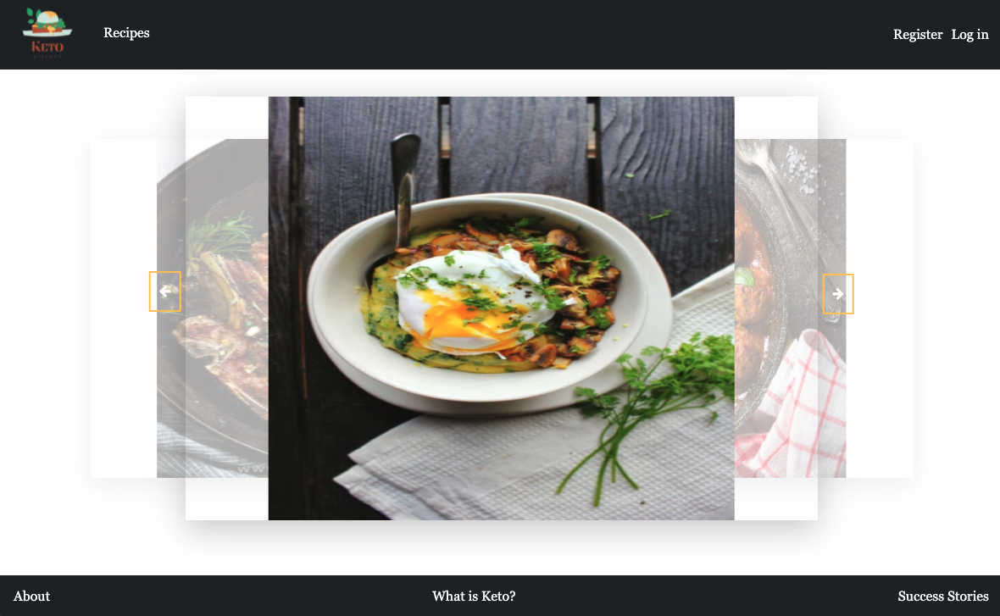
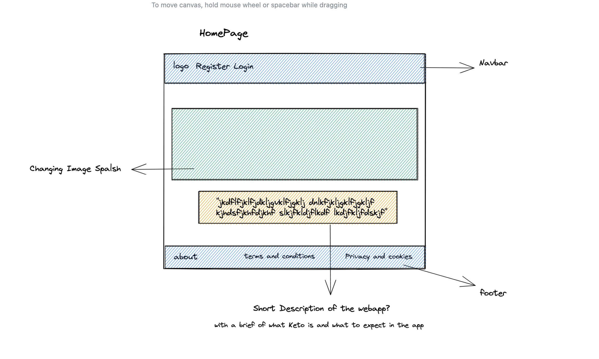
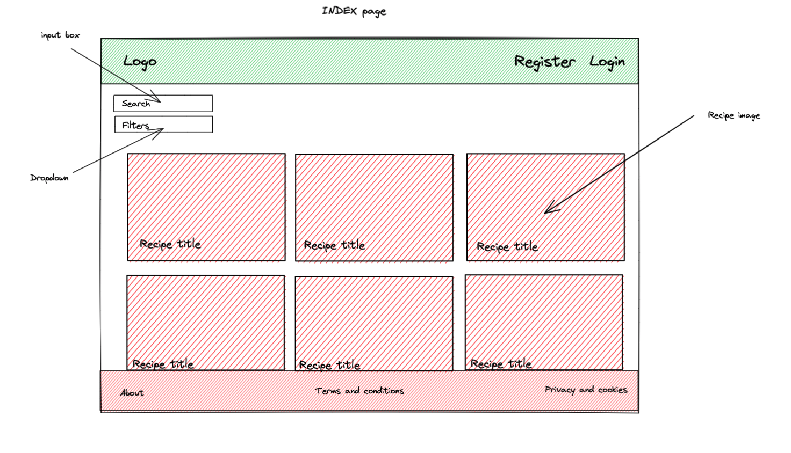

# Keto  Kitchen

<br />

### Overview
Project 3 was the first group project of the course where my teammates and I opted to build a keto recipe app. We choose a recipe app in homage to the start of the new year and the resolutions people tend to set at the start of the year. 
Working with classmates includes:
* Deniss Bulai [GitHub](https://github.com/astounded2006)
* John Davies [GitHub](https://github.com/tigeryant/sei-project-three-fe)
* Sally Saghair [GitHub](https://github.com/sallyali7)



### Deployment
This app has been deployed with Heroku on the backend and netlify on the frontend. The front end of the app can be found here: [Deployed App](https://ketokitchen.netlify.app/)

### Getting Started
1. Access the source code via the 'Clone or download' button
2. In CLI, run  `npm i` on the root level to install dependencies for the backend
3. In CLI, open a new tab, and navigate to frontend cd frontend and run the same command `npm i` to install dependencies
4. Run command `npm run dev` in both tabs to run program in your local environment

### Brief:
Build a full-stack application by making your own backend and frontend. Using Express API to serve data from a Mongo database. Ensure the app has CRUD functionality in 7 days.

### Technologies Used:
* Node.js
* Express.js
* MongoDB
* Mongoose
* JavaScript
* React.js
* Axios
* Bootstrap CSS Framework
* GitHub

### Functionality
The functionality is similar to many popular social sites. Users can:
* Register and Login
* Favourite and comment on recipes
* Search and browse recipes

### Process
#### Planning
To begin this process, my teammates and I brainstormed ideas on what we wanted to do for the project. We decided on a recipe application and made a plan of what we wanted to achieve, the functions we wanted and the relationships we wanted to build. We wanted to use Agile Methodology for the project to ensure quality, so we ensured we had daily stand-ups to keep each other informed on progress and any issues.
We created wireframes for the web page to give us visual guidance.



Once we planned out the functionality that we wanted on the frontend we used that to determine the information we will need to include in the backend.

#### Work Split
We worked together on the backend populating the database and setting up the middleware and building the schemas.
We divided up the work on the frontend so everyone could own an area of work and move forward with implementing the solutions to a particular function.
* **Sally Saghir:**  Styling to the pages and implementing the carousel feature on the landing page
* **John Davies:** User authentication, favourite feature on the backend and profile page
* **Deniss Bulai:** footer page content and styling

The area of work that I owned on the frontend includes: 
* Search and filter functions
* Favourite function on the recipe page
* Styling of footer pages

#### Build

When we were happy with the wireframes and the work plan we began to work together on our backend in Express.js, creating models, controllers, and routes.

We built schemas for both recipes and comments, which were related through a one-to-many relationship. We wanted users to be able to comment on recipes, add new recipes and favourite recipes so we ensured these features were built into the models and the middleware.
``` JavaScript 
const commentSchema = new mongoose.Schema({
  text: { type: String, required: true, maxlength: 200 },
  rating: { type: Number, required: false, min: 1, max: 5 },
  addedBy: { type: mongoose.Schema.ObjectId, ref: 'User', required: true },
}, {
  timestamps: true,
})

const recipeSchema = new mongoose.Schema({
  course: { type: String, required: true },
  title: { type: String, required: true, unique: true },
  image: { type: String, required: true },
  prepTime: { type: Number, required: true },
  calories: { type: Number, required: true },
  protein: { type: Number, required: true },
  carbs: { type: Number, required: true },
  fats: { type: Number, required: true },
  ingredients: { type: Array, required: true },
  preparation: { type: Array, required: true },
  comments: [commentSchema],
  
  addedBy: { type: mongoose.Schema.ObjectId, ref: 'User', required: true },
  favouritedBy: [{ type: mongoose.Schema.ObjectId, ref: 'User', required: true }], 
})
```
I then began to focus on the work allocated to me on the frontend and implemented the search and select functions by setting the search value and selected course as a react state then filtering through the recipes and returning the search value and the selected course.

``` JavaScript
const handleFavouriteClick = async e => {
    e.preventDefault()
    try {
      const faveClick = await toggleFavourite(recipeId)
      const favouriteId = faveClick.data.favouritedBy.id
      setFavouriteId(favouriteId)
      console.log(faveClick.data.favouritedBy)
      setHasFavourited(!hasFavourited)
    } catch (err) {
      setIsError(true)
    }
  }
  ```
I implemented the function to handle the favourite by setting the favourite as a react state and using a boolean to check if a user has favourited a recipe or not. I then stored the favourite ID in a variable and used that to set the favourite ID state.
We used Bootstrap CSS framework to style the pages to achieve uniformity in the design and look of the app.

``` JavaScript
  const handleSelect = (e) => {
    setSelectedCourse(e.target.value)
  }
  const handleSearch = (e) => {
    e.preventDefault()
    setSearchedValue(e.target.value)
  }
  console.log(searchedValue) // test


  const filteredCourses = (recipes) => {
    return recipes.filter(recipe => {
      return (
        recipe.title.toLowerCase().includes(searchedValue.toLowerCase()) &&
        (recipe.course === selectedCourse || selectedCourse === 'All Meals')
      )
    })
  }
  ```
  #### Styling
  For the styling of the page, we utilised the Bootstrap Framework.

  ### Challenges
  The main challenge we faced in this project was Git version control. It was the first time we used Git version control and navigating handling the conflicts that arose were interesting and challenging.

  ### Wins
  A big win for us was reaching the MVP on functions that we wanted to be included in the app as it was our first time building a full-stack React app.

  ### Future Improvements
  Our stretch goal was to enable users to add new recipes, we managed to include that in the schema on the backend but did not build the functionality on the frontend. With more time it would be great to include this feature.

  ### Key Learnings
  Working with Git version control as a team has really helped to cement my knowledge on how GitHub works, branches and merging. 


